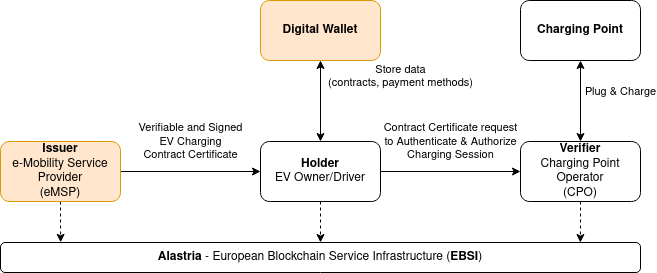
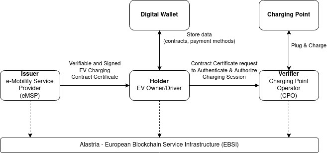
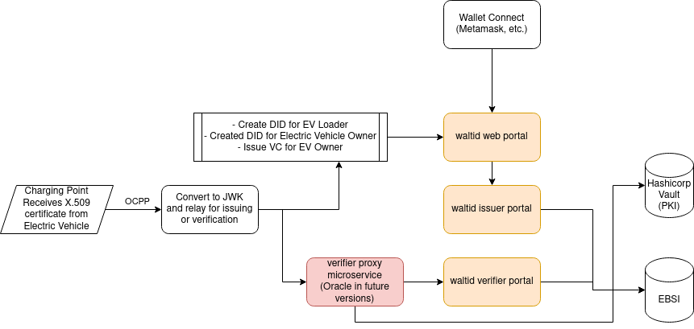

EVI: Electric Vehicle Identity
============

Protecting driver privacy,
while streamlining transactions in public charging
stations

This Github repository contains code created to serve the following Use Cases:

• Enable Drivers of electric vehicle to store contract certificates within their electric vehicle and connect them to the digital wallet of their preference.

• Enable Charge Point Network operators and e-Mobility services providers to verify contract certificates that are relayed when I drive attemps to start a session at an EV Charging Station.

Contents
Inside the Github repo https://github.com/NGI-TRUSTCHAIN/EVI EVI team has included:

• Docker Compose file specifying different utilized to support vehicle certificate issue and verify processes including Walt.id wallet and VC services

• Example of Vehicle Certificate JSON file: vc contract Json

• Example of Vehicle Certificate issue function: vc contract issue Json. This function runs when an EV driver that has signed up with the service, issues a vehicle certificate that is then installed to the vehicle that is connected to the charging station

• Example of Vehicle Certificate read function. This function passes vehicle certificate to the verifier proxy when a vehicle with installed vehicle certificate vc_verify Json

• Verifier Proxy Folder: The folders include services used to verify credentials read when drivers initiate charging sessions.

Walt.id wallet based implementation

